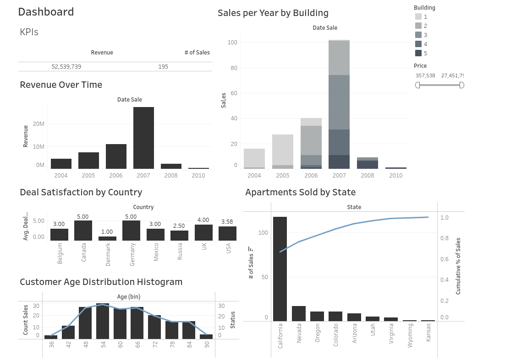

# 🏦 Estate Data Analysis: *Data-Driven Insights into Real Estate Trends*

📊 **Dashboard**: [View on Tableau Public](https://public.tableau.com/views/estate-market-analysis-dashboard/Dashboard1?:language=en-US&:sid=&:redirect=auth&:display_count=n&:origin=viz_share_link)

## 📌 Overview

This project is a personal exploration of real estate and customer data. Using Python for preprocessing and analysis, and Tableau for visualization, it aims to identify trends in sales, customer demographics, and building types. While the approach is structured and the results are data-driven, this is a pet project and not intended for professional or commercial use.

## 🎯 Objectives

This analysis seeks to understand the customer profile and building characteristics by answering the following questions:

- Which customer age bracket has the greatest buying potential?
- What is the most sought-after building type?
- Which building type has the highest price?

## 📈 Dashboard

## 🧠 Insights

- Most customers were aged **48–71**, primarily middle-aged and senior adults, with the majority residing in **California, USA**.
- **Type 2 buildings** are the most in-demand, followed closely by Type 3. **Type 5** is the least sought after.
- **Type 2 buildings** are also the most expensive. **Type 4** offers the best deal satisfaction; it has the largest area and a moderate mean price.
- A **sales boom occurred in 2007**, followed by a sharp decline in 2008.
- In the U.S., sales were heavily concentrated in a few **top-performing states**.

## 🛠️ Tools & Technologies
- 🐍 Python (data preprocessing & analysis)
- 📊 Tableau (interactive dashboards & visualizations)
- 🐼 pandas 
- 📎 Jupyter Notebook 

## 📂 Dataset

The dataset used in this project was provided as part of the 365 Data Science learning platform. It may not be publicly distributed, so the raw data is not included here.

